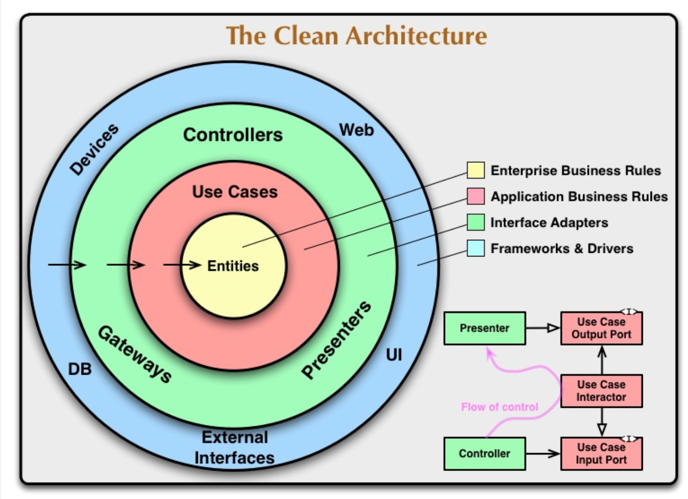
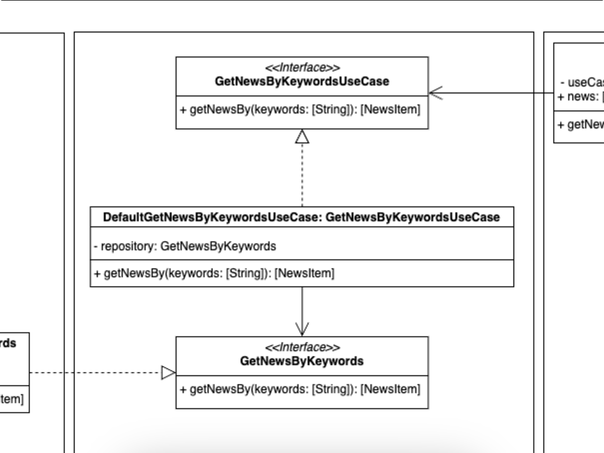

# Arquitecturas limpias, como desacoplar la lógica de negocio de los detalles de infraestructura

Se dice que una arquitectura es limpia cuando consigue una exitosa separación entre la lógica de negocio y los detalles de la infraestructura. Dicha separación se consigue mediante capas, una fuerte aplicación de los principios SOLID y un estricto cumplimiento de lo que llamaremos "La regla de la dependencia". Hablaremos de ella más adelante.

Según Robert C. Martin, Uncle Bob, estas arquitecturas generan sistemas, productos, que son: 
1. Independientes del framework usado.
2. Con unas reglas comerciales que deben poder ser medibles sin depender de la interfaz del usuario, base de datos, servidor web, etc.
3. Independientes de dicha interfaz de usuario. De hecho, ésta, debería poder ser intercambiable sin afectar a las reglas comerciales, a la anteriormente citada lógica de negocio.
4. Independientes de la base de datos usada, si es que es necesario usarla, independiente del sistema de persistencia de datos, local u online.
5. Independientes, en general, de cualquier interferencia externa. 

> En resumen: Las reglas de negocio no deben de conocer nada de los detalles de infraestructura, para así no depender de estos. 

Más en detalle...

## Lógica de negocio

La llamada lógica de negocio representa el dominio. Se trata de una serie de reglas, acciones y datos que representan nuestro negocio, sus actividades, etc. Por ejemplo, en una aplicación bancaria parte de nuestra lógica de negocio serían los modelos destinados a abstraer las cuentas corrientes del usuario, las tarjetas, movimientos, etc. ¿Qué entraría también en nuestra lógica de negocio?, todas aquellas reglas que nos ayuden a definirlo: impedir que un usuario sin fondos intente hacer una transferencia, verificar que la cuenta aportada por el usuario tenga un IBAN válido, la lógica de ofuscación para que no se muestre el número de cuenta completo sino sustituyendo algunos dígitos por asteriscos...

> **Importante**: La lógica de negocio es común a todos los departamentos de la compañía: marketing, diseño, producto...

## Detalles de la infraestructura

Aquí hacemos referencia al framework que usamos para diseñar las vistas de nuestra aplicación, la librería de red, el inyector de dependencias, la base de datos, el modelo de persistencia, etc. 

Estos componentes "no tienen vida" fuera de nuestro sistema, nuestra app, nuestra web. Y deberían ser transparentes para el resto de departamentos de la compañía. 

> Mientras que la lógica de negocio varía poco en el tiempo, los detalles de infraestructura sí que pueden verse alterados. En un MVP podemos decidirnos por usar un sistema gestor de base de datos sencillo, poco escalable, y rápido de implementar, ya que solo queremos ver si nuestro producto tiene tracción en el mercado. En caso de funcionar podríamos necesitar cambiarlo. O cambiar el framework mediante el que presentamos la interfaz al cliente porque éste haya sido descontinuado.

> Por ésto último decíamos que las reglas de negocio no debían conocer nada de los detalles de infraestructura, por la alta posibilidad de que estos cambien en el futuro. Implementando una arquitectura limpia podemos conseguir que si necesitamos cambiar alguna parte de nuestra infraestructura, la pieza a cambiar pueda ser sustituida por otra sin afectar a nuestra lógica de negocio, minimizando así el impacto de dichos cambios.

En la siguiente imagen, del [blog de Robert C. Martin (Uncle Bob)](https://blog.cleancoder.com/uncle-bob/2012/08/13/the-clean-architecture.html), podemos ver una representación de capas y responsabilidades que deberían de cumplirse en cualquier arquitectura limpia. 

En su artículo de referencia, [aquí](https://blog.cleancoder.com/uncle-bob/2012/08/13/the-clean-architecture.html), Uncle Bob explica que el número de capas, los círculos, son esquemáticos, que no hay por qué tener "solo" cuatro capas, éstas serían las mínimas. A la hora de crear nuevas capas, o dividir alguna de las actuales, solo tendríamos que tener en cuenta que se siga aplicando la regla de la dependencia. 

## Capas de nuestra arquitectura

¿Cómo podríamos llevarnos esta *clean architecture* a nuestro proyecto con SwiftUI o Jetpack Compose?, montémoslo paso a paso.

### Core
---

Contendría el código más estático, aquel del que va a depender el resto. Todas las capas exteriores van a depender de ésta, estarán acopladas a ella, por lo que cualquier cambio en esta capa tendrá repercusiones en el resto de capas de nuestra arquitectura. 

Esta capa no tiene ningún acoplamiento con una capa exterior, es más, no debe conocer ningún componente creado fuera de su propia capa. Esto es lo que denominamos **La regla de la dependencia** y es de obligado cumplimiento para mantener nuestra arquitectura limpia. Y no solo es de obligado cumplimiento para esta capa, también para todas las exteriores, ¿qué nos dice Uncle Bob de la regla de la dependencia?

> **La regla de la dependencia:**  
>
> *La regla primordial que hace que esta arquitectura funcione es la regla de dependencia . Esta regla dice que las dependencias del código fuente sólo pueden apuntar hacia adentro . Nada en un círculo interno puede saber nada acerca de algo en un círculo externo. En particular, el nombre de algo declarado en un círculo exterior no debe mencionarse en el código del círculo interior. Eso incluye funciones, clases, variables o cualquier otra entidad de software.* - Uncle Bob

¿Qué contendría, por ejemplo, esta capa Core?

1. **Modelos de dominio:** abstracción de una cuenta corriente, tarjeta de crédito, débito, movimiento, comisión...
2. **Servicios de dominio:** clases relacionadas con los modelos de dominio y que ayudan a implementar nuestras **reglas de negocio, hablaremos de ellas en la siguiente sección**. Por ejemplo, la clase que se ocupa de calcular las tasas que vas a pagar por una determinada operación, la funcionalidad que se ocupa de verificar que, a priori, no hay un problema para realizar una transferencia, la comprobación de que no estás intentando enviar más dinero del que tienes en la cuenta...

> No confundir estos servicios de dominio con una clase que, por ejemplo, realice una petición de red para recibir el visto bueno a un préstamo, o a una transferencia, estos servicios de dominio engloban y abstraen nuestra lógica de negocio, nuestras reglas. No os preocupéis si no estáis familiarizados con estos términos, terminaremos entendiéndolos mejor con los ejemplos. 

Nuestos modelos de dominio también los encontrarás citados, aquí o en otros artículos, charlas, etc, como **Entities** o **Data Objects**. Veamos una representación de esta capa.

Los componentes de esta capa solo pueden tener dependencias entre ellos, tanto de los modelos como de los servicios, ya que están en la misma capa. Como podemos apreciar en esta representación, nuestra capa **core** no conoce nada fuera de su capa, no hay una capa inferior de la que dependa.

¿Qué tipo de acoplamiento podríamos tener en esta capa?, pues por ejemplo: la abstracción *CreditCard* podría tener una dependencia con *Movements* al tener que gestionar una colección de éstos.

### Lógica de negocio
---

Esta capa contendría las reglas comerciales específicas de nuestra aplicación. Por convención, al software que diseñamos en esta capa se le llama **Casos de Uso**. Los usamos para dirigir el flujo de datos desde nuestras entidades y hacia éstas. 

**¿Reglas comerciales?, ¿Reglas de negocio?, ¿de qué nos estás hablando?, veámoslo mejor con ejemplos...** 

- Queremos que el usuario pueda realizar una transferencia a otra cuenta bancaria, las reglas de negocio podrían ser: 
    - Impedir que intente realizar la transferencia si no tiene fondos suficientes
    - Verificar que la cuenta de destino tiene un formato correcto (20 dígitos)
    - Verificar que el IBAN de la cuenta es correcto (el IBAN se calcula en base al número de cuenta)

Los cambios en esta capa no afectarían a nuestros modelos de dominio y tampoco deberían verse afectados por cambios externos. ¿Cómo mantenemos nuestra *regla de la dependencia*?. Los casos de uso establecerán sus *contratos*, *protocolos*, *interfaces*, como queramos llamarlos, y serán implementados por los componentes de la capa superior.

Estos protocolos habitan en la misma capa que los casos de uso, ya que pertenecen a nuestra lógica de negocio. 

Dicho todo esto, nuestros casos de uso tendrían dependencias de: 
1. Nuestros modelos, y servicios, de dominio, que se encuentran en una capa inferior.
2. Otros casos de uso. Un caso de uso podría necesitar información que obtuviese mediante otro.
3. Los protocolos, interfaces, que implementan o de los que tienen dependencias por composición. 

¿Cómo quedaría nuestra representación de capas?

He dibujado la dependencia de esta capa, con la capa inferior, mediante una flecha hacia dentro del gráfico. Lo veréis así en el resto del artículo, y también con el resto de capas.

### Adaptadores
---

Los adaptadores establecen un puente entre la lógica de negocio y los detalles de infraestructura. Aquí se encuentran los componentes que implementan los contratos, protocolos, interfaces, definidos en la capa inferior (Casos de uso).

Esta capa también se ocupa de "traducir", mapear, los datos que obtenemos desde capas externas a datos de nuestra lógica de negocio.

La capa de adaptadores estaría dividida en varias secciones, cómo mínimo, estas dos:
1. **Capa de presentación:** donde encontraríamos los viewmodels, presenters, etc
2. **Capa de datos:** donde encontraríamos los repositorios, protocolos de datasource, mappers, protocolos de Data Objects, etc

Hay un cambio importante con relación a las capas inferiores. En éstas todos sus componentes se "conocían" entre sí y podían depender unos de otros. En la capa **Adaptadores** esto no es posible, y es muy importante que se cumpla esta regla. Los componentes de la capa de presentación no pueden tener ningún tipo de dependencia de componentes de la capa de datos y viceversa, no pueden estar acoplados. 

Un ViewModel no podría, por ejemplo, instanciar un objeto de la capa de datos, tendría que hacerlo a través de los casos de uso, a través de su capa inferior. Son flujos que están separados. Ayúdemonos de una representación gráfica:

> La capa de adaptadores podría estar dividida en más partes, secciones. He citado estas dos porque considero que son las más comunes a cualquier arquitectura limpia, independientemente de la tecnología del proyecto, sea web, app, etc...
> 
> Por ejemplo, un manager que gestionase la analítica de nuestro negocio, aplicación, etc, también pertenecería a esta capa de adaptadores. Y al igual que las capas de presentación y datos no podría tener dependencias con éstas. 

Podemos observar cómo la capa de adaptadores está acoplada a la de use cases, así como ésta lo está a la de dominio. Nada definido aquí, en la capa de adaptadores, podría ser "invocado" en la capa de use cases. Para eso usamos el principio de la inversión de dependencias, implementamos en nuestros componentes los protocolos necesarios, que tenemos definidos en la capa inferior, y los inyectamos donde sea necesario.

Si nos fijamos, esta capa tiene dependencias de los protocolos de casos de uso que tiene que implementar y de los modelos de datos que usen estos protocolos, en resumen, de sus capas inferiores. Pero no sabe si vamos a realizar las llamadas de red mediante URLSession o HttpURLConnection, o a usar una librería de terceros como Alamofire u OkHttp. No sabe si persistiremos los datos sensibles en UserDefaults - SharedPreferences o usaremos Keychain - KeyStore (es un ejemplo, para datos sensibles usad KeyStore - Keychain).

Esto quiere decir que esta capa de red desconoce estas implementaciones, por lo que evita su acoplamiento a las mismas. ¿Cómo se comunica con las capas superiores?, de la misma forma que los use cases se comunican con ellos, mediante contratos, interfaces, protocolos y, de nuevo, la magia de la inversión de las dependencias. 

### Capa de infraestructura
---

Al principio del artículo hablábamos sobre que había que separar la lógica de negocio de los detalles de la infraestructura. Hasta ahora habíamos visto la lágica de negocio, mediante sus capas contenedoras de las entidades y casos de uso. Y también habíamos hablado de una capa, adaptadores, que hacía de puente entre ésta y la capa de infraestructura. Hablemos ahora de ésta última.

Esta capa contendría todos los componentes relacionados con la interfaz de usuario, por ejemplo las vistas en Jetpack Compose - SwiftUI o XML - UIKit. Contendría las clases necesarias para realizar una llamada de red y obtener los datos que necesitamos inyectar en nuestros repositorios para que éstos, a su vez, lo hagan en los casos de uso. Para ello usaríamos URLSession, HttpURLConnection, Alamofire, OkHttp o similares. En caso de tener que persistir datos sería esta capa la que se encargaría de implementar la funcionalidad mediante una base de datos local (sqlite, room, coredata, swiftdata...)

Fijáos en la diferencia de esta capa con las más internas. Aquí ya estamos hablando de tecnologías, frameworks, etc. Mientras antes hablábamos de cuentas, movimientos, tarjetas...

Esta parte, aunque no nos entre en la cabeza a los desarrolladores, es transparente al usuario y al resto de stakeholders de la compañía. Aunque nos duela, esta parte solo nos interesa a nosotros...

Esta es la parte que es más susceptible de sufrir cambios durante la vida de un proyecto. Mediante nuestra arquitectura limpia conseguimos que un cambio en cualquier componente de esta capa no tenga ninguna repercusión en las capas inferiores, en nuestra lógica de negocio. Si tenemos que cambiar alguno de estos componentes estará tan aislado que el cambio se limitará a sustiuir un componente por otro, sin que el resto de componentes deba sufrir ninguna alteración. Si lo hacemos bien, estos componentes, de red, de UI, de almacenamiento, etc, actuarán como meros plugins de nuestra lógica de negocio, sustituibles. 

Nadie espera tener que modificar las ruedas de una bicicleta, o el sistema de frenado, al cambiar el sillín de una bicicleta. Nuestras arquitecturas deben funcionar igual. Nuevamente conseguimos esta capacidad de fácil sustitución mediente el uso de los principios SOLID y su inversión de las dependencias.

¿Echamos un vistazo a la representación final de nuestra arquitectura?

> Esta capa tiene la misma particularidad que la capa adaptadores, aunque las vistas están en la misma capa que los *data sources* éstos no se *"conocen"*, no tienen dependencias entre ellos ni por herencia ni por composición. En resumen, no están acoplados entre ellos. 

Acoplar la lógica de negocio y los detalles de infraestructura lleva siendo un problema desde que empezamos a desarrollar software, no es algo nuevo. Este movimiento no ha surgido en los últimos 10 años debido al purismo de algunos desarrolladores. No, el senior no está intentando ponértelo más difícil...

Este problema ya existía cuando los programadores escribían software que leía información de tarjetas perforadas. ¿Qué creéis que pasaba cuando les pedían cambiar dicho programa para que ahora leyese la información de una cinta magnética?...

## Ventajas e inconvenientes

### Ventajas

**Coste:** Una mejora significativa en el coste de nuevas features al tener el código mejor estructurado, más desacoplado y con una visión más clara, y amplia, de los elementos que vas a necesitar para implementar cada una de las capas de tu arquitectura.  
**Mantenibilidad:** La separación de "preocupaciones", "responsabilidades", facilita la modificación de una parte del sistema sin afectar a otras.  
**Testing:** La independencia de los componentes hace que las pruebas unitarias sean más sencillas de implementar.  
**Modularidad:** La arquitectura modular permite añadir nuevas funcionalidades sin necesidad de grandes cambios en el código existente.  
**Adaptabilidad:** Es más fácil adaptar la aplicación a nuevas tecnologías ya que los cambios en los detalles de la infraestructura no afectarán a la lógica de negocio, capa de dominio, etc.  
**Reutilización de código:** Los componentes independendientes pueden ser reutilizados en otros proyectos.  

### Inconvenientes

**Curva de aprendizaje:** Puede ser complicado de aprender y entender para desarrolladores juniors.  
**Sobrecarga inicial:** La configuración y la estructura inicial pueden ser más complejas y consumir más tiempo que otras arquitecturas más simples.  
**Sobreingeniería:** En aplicaciones pequeñas puede resultar en una sobreingeniería que no justifique los resultados obtenidos.  
**Dificultad de implementación:** Requiere de desarrolladores con experiencia y un equipo disciplinado que siga las prácticas y principios establecidos.  

## Flujo y responsabilidades

Cuando, en este mismo artículo en la sección de Adaptadores, hablábamos del flujo de información mostrábamos esta imagen:  

  

> No hay una única manera de estructurar una arquitectura limpia, en base a la experiencia del desarrollador, a los requisitos de la aplicación, herramientas a usar, etc, nos podremos encontrar con una u otra forma. Por ejemplo, los DataSources, de los cuales veréis un ejemplo más adelante, hay desarrolladores que los "implementan" en la capa de adaptadores mientras que otros lo hacen en la de infraestructura. Al tratarse de una separación "lógica" puede no tener ninguna repercusión más allá de ubicarse en una estructura jerárquica de carpetas u otra. Mientras se respete la regla de la dependencia no debería haber ningún problema. En mi humilde opinión, si conoce información de infraestructura, como por ejemplo, datos muy concretos de cómo montar los endpoints de llamadas a apis debería estar en infraestructura. 

Veamos ahora, mediante un diagrama UML, un resumen simplificado de una posible arquitectura limpia para un caso de uso en concreto. Imaginemos que queremos crear una aplicación de noticias. Uno de nuestros casos de uso principales es el de obtener un listado de noticias recientes en base a una palabra clave. ¿Cómo podríamos dividirlo?, veamos un ejemplo:

### Caso de uso

Nos encontramos en la capa de dominio, hemos creado nuestro caso de uso **GetNewsByKeywordUseCase**. ¿Cuál es su responsabilidad?, este caso de uso se ocupa de preparar los datos para aplicar correctamente la lógica de negocio. Por ejemplo, podría recibir los datos y, para cumplir con dicha lógica, ordenarlos en base a una determinada propiedad: nombre, publicación...  

También podría ocuparse de filtrar los artículos para excluir aquellos cuyo contenido se considerase inapropiado, etc. En resumen, una vez obtenidos los datos los tendría listos para ser devueltos a quien los requiriese.   

- Un momento, ¿no tiene demasiadas responsabilidades?, ¿tiene que ocuparse de recibir los datos y prepararlos en base a nuestras reglas de negocio?...  
    - Bien visto, pero para la obtención de datos se apoya en lo que convencionalmente denominamos repositorio. Será a dicho repositorio al que le solicitaremos los datos correspondientes, delegando esa responsabilidad en éste y manteniendo nuestro principio de responsabilidad única. Además nuestra dependencia del repositorio está invertida, por lo que especificamos de forma abstracta a la capa superior qué necesitamos, pero sin especificar ningún tipo de implementación. De esta forma dependemos de una abstracción, no de ninguna implementación concreta que rompa nuestra regla de la dependencia. 

> En el principio SOLID **Inversión de la dependencia**, en muchas ocasiones, se hace referencia a que los módulos de alto nivel no deberían depender de los módulos de bajo nivel y que, ambos, deberían depender de abstracciones. 
>
> Con módulos de alto nivel se refieren a nuestra lógica de dominio, nuestra reglas de negocio, nuestras entidades...
> Nos indica que estos módulos no deberían de depender, por ejemplo, de componentes de la capa de infraestructura como la interfaz de usuario o la base de datos.

### Adapters -> Repository

Pasamos a la capa Adaptadores y nos encontramos con una clase que implementa el protocolo, la interface, GetNewsByKeyword. ¿Qué nos indica?, que puede ser inyectada como dependencia en la clase GetNewsByKeywordUseCase. Y de esta forma cumplimos, una vez más con nuestra regla de la dependencia. GetNewsByKeywordUseCase no "conoce" nada de su capa superior, no "sabe" nada de NewsRepository o ApiDataSource. Ni lo necesita, y eso es fantástico, ¿por qué?, porque no está acoplado a nada de esta capa Adaptadores. Cualquier cambio que se realice en dicha capa podrá afectar a componentes de su misma capa o de su capa más superficial, infraestructura, pero nunca a la capa de dominio. No es magia, es una buena arquitectura.  

En esta capa, adaptadores, se encuentran los componentes que se encargan de convertir los datos que nos provee la capa de infraestructura, los convencionalmente llamados DTOs, en los modelos de datos que requieren nuestras casos de uso, normalmente llamados Entities, Data Models, etc. También a la inversa, estos componentes se ocuparán de crear, mediante los modelos de datos de dominio, los datos más convenientes para la base de datos de turno, api rest o similar.  

¿Responsabilidades de esta clase NewsRepository?, obtener los datos de la fuente externa que toque, en sus modelos, y convertirlos en nuestros modelos de dominio. A esta operación la solemos llamar mapear.   

De nuevo, ¿dos responsabilidades?, no. Para la obtención de los datos en bruto del servicio, base de datos, etc, se apoya en un DataSource, una clase que se encarga de esa responsabilidad. Y aunque no lo he especificado para no agregar más complejidad al ejemplo, también el proceso de mapeo sería delegado en otra clase...

> Para más información sobre este tipo de clases se pueden revisar los patrones de diseño Facade y Adapter, pues comparte similitudes con ambos. 

¿Cómo realizamos la relación entre la clase NewsRepository y los componentes de su capa más exterior?, también mediante inversión de dependencias. La interface ApiDataSource declara lo que la clase NewsRepository necesita y se "olvida" de su capa superior, no es su problema.

La capa superior tendrá la responsabilidad de crear un componente que pueda cubrir la necesidad impuesta por la interface ApiDataSource. Y este componente, sea cual sea, podrá ser inyectado como dependencia en NewsRepository. Pero NewsRepository no sabrá qué implementación concreta está siendo inyectada, por lo que no estará acoplada a ella y una futura modificación de esta nunca podrá afectarle. No podrá afectar a nada de la capa de dominio, ni casos de uso, ni entidades. Estoy repitiendo algo que he comentado tres párrafos más arriba, ¡porque es vital que se entienda!.  

> Said Rehouni, en su [canal de youtube](https://www.youtube.com/@SaidRehouni) y su [curso sobre clean architecture](https://www.youtube.com/watch?v=nILL3UXrMS0) advierte ante la creación de repositorios masivos en los que se acumulen la resolución de las necesidades de todos los casos de uso asociados a una misma feature. Habla sobre que esto crea una mayor dificultad para testear dichos repositorios, mockearlos y que hace que incumplan el principio de responsabilidad única. 
>
> Este principio nos dice que una clase solo debería tener un motivo para cambiar. Si dicho repositorio está gestionando todos los casos de uso de una misma feature, con sus distintos modelos de datos, etc, es muy posible que sea susceptible a cambiar con cada una de las modificaciones que puedan realizarse en cada uno de estos modelos de datos. 
>
> Para estos casos recomienda crear distintos **repositories** para atender a una misma feature. 

### Infraestructura -> Data

Empecemos hablando de **APINewsDataSource**. Se trata de una clase que implementa la interface ApiDataSource por lo que podrá ser inyectada en NewsRepository. Entre sus responsabilidades se encuentra la de crear los Endpoints que se usarán, por el cliente de turno (URLSession, HttpConnection, Alamofire, OkHttp...), para la obtención de los datos que necesita "servir" en su cumplimiento de la interfaz. También se ocupa de convertir los datos en bruto recibidos por el backend en nuestros data objects (Los DTOs que espera el repositorio).

Parece que volvemos al patrón común, una clase con mas de una responsabilidad. Y de nuevo lo solventamos de la misma forma. APINewsDataSource se apoya en la interface HTTPClient como dependencia. APINewsDataSource se ocupará de generar los endpoints de los que hablábamos en el párrafo anterior y delegará la obtención de los datos correspondientes a éstos en el componente que se le inyecte mediante inversión de dependencia. De la misma forma obtendrá mediante inversión de dependencias un componente que se ocupará de realizar la deserialización del DATA bruto en los DTOs correspondientes. De nuevo, no he querido agregar estos componentes al diagrama UML por simplificar su entendimiento.

Importante, si aquí httpClient no fuese una abstracción, sino una clase concreta con esa misma responsabilidad, no estaríamos incumpliendo la regla de la dependencia ya que dicha clase estaría dentro de su misma capa, la de infraestructura. Pero agregando, de nuevo, una inversión de dependencia conseguimos que, en caso de tener que cambiar algo en la clase concreta dicho cambio no afecte a APINewsDataSource.  

¡Estamos creando una nueva capa!, aunque más bien sería una subcapa, pero a nivel de obtención de beneficios es lo mismo. APINewsDataSource no se está acoplando a un ciente http concreto, con lo que, en el futuro, este componente podrá cambiar sin afectar a los componentes de su "subcapa" inferior. 

Hablemos de **ApiManager**. Se trata de un componente de software cuya responsabilidad es la de generar la petición de red adecuada, puede ser una URLRequest en iOS o una Request de OkHttp para Android, y realizar la llamada al backend. En este caso se apoyará en un componente, al que hemos llamado **networkHandler**, que será el que realice dicha petición en base a la request creada por **ApiManager**. Obviamente, este **networkHandler** es una abstracción que será inyectada ya que es el candidato perfecto a cambiar en un futuro.

En la parte más externa de nuestro diagrama encontramos una clase, **URLSessionNetworkHandler**, que implementaría el protocolo NetworkHandler y cuya responsabilidad sería la de hacer la petición http en base a la request recibida. La he llamado **URLSessionNetworkHandler** pero también podría haberse llamado **HttpConnectionNetworkHandler** o **OkHttpNetworkHandler**, etc...

En este tipo de componentes es donde más fácil podemos ver la actuación como simples "plugins" de los componentes de la capa de infraestructura. Y podemos observar todas las ventajas de una buena abstracción y separación de responsabilidades. 

Bien, volvamos a la capa de adaptadores, pero veamos qué tenemos a la derecha de los casos de uso, hablemos de la capa de presentacion...

### Adapters -> Presenters

En el otro lado del flujo de datos nos encontramos con los presenters. Al igual que hacían en la capa de repositorios aquí también actúan de intermediarios entre los casos de uso y, en este caso, la interfaz de usuario. 

Los presenters reciben los datos de los casos de  uso y los preparan para su uso en la interfaz de usuario correspondiente, en nuestro caso vistas de SwiftUI o Composables de Jetpack Compose. Con esto se garantiza que la vista reciba solo los datos que necesita y en el formato que los necesita. 

Para seguir cumpliendo con la regla de **depender de abstracciones y no de implementaciones** la dependencia que tiene el  viewmodel con el caso de uso también lo hace sobre una abstracción, no sobre una implementación concreta de dicho caso de uso.

### Infraestructure -> UI

Para completar con nuestra arquitectura llegaríamos a la capa de infraestructura por la parte de la interfaz de usuario. En este ejemplo sería una View de SwiftUI o un Composable de Jetpack Compose. 

Y con esto habríamos completado nuestra arquitectura limpia para un feature en concreto. En la siguiente sección hablaremos de algunas cuestiones a valorar. 

## Problemas y rupturas de la arquitectura

En la parte de la interfaz gráfica, donde se encuentran el caso de uso, el viewmodel y la vista, se sigue cumpliendo estrictamente la regla de la dependencia, en concreto: 
- El caso de uso, en la capa de dominio, no conoce al ViewModel y no tiene ninguna dependencia con éste. 
- El ViewModel, en la capa de adaptadores, no conoce a la View, no tiene acoplamiento a ésta.
- La View, en la capa de Infraestructure usa el ViewModel que tiene en una capa más interna, por lo que no hay ningún problema. 

Pero sí que nos encontramos con un problema, al menos en el caso de una implementación con SwiftUI. Y es el framework de reactividad. 

En las primeras versiones de SwiftUI podría tratarse de Combine, de Observation para iOS 17 en adelante o incluso, Steve Wozniak no lo quiera, una librería de terceros. 

La cuestión a tener en cuenta es que este ViewModel en la capa de Adaptadores no debería estar acoplado a un detalle de la infraestructura. ¿Podría resolverse?, sí, podría crearse un componente intermedio que no contuviese información al respecto del framework reactivo. 

Dicho componente usaría el caso de uso para obtener la información. ¿Cómo se comunicaría con el ViewModel?, de nuevo mediante inversión de la dependencia. 

Se me ocurren varias formas, por ejemplo, mediante el patrón protocolo delegado, haciendo que el ViewModel lo implementase. Los ViewModel, en SwiftUI, son clases así que no habría problema en que el composition root usase una referencia de dicho ViewModel y lo inyectase como delegado. En el proyecto de ejemplo que adjunto a este artículo hay una rama en la que creo este componente intermedio. 

También podríamos usar el patrón observer, de nuevo una combinación de pasos por referencia y protocolos haría posible resolver el problema. 

Pero en este caso he optado por no agregarla. ¿Por qué?, decisión de arquitectura, no lo he creído conveniente. O más bien, no he visto que aporte el valor suficiente para compensar la complejidad extra. 

Y aquí es dónde vienen las malas caras, ¿cuánto de puristas queremos ser?, o como se dice en mi pueblo, ¿queremos ser más papistas que el papa?

Cada desarrollador encargado de crear la arquitectura de un proyecto tendrá que enfrentarse a estas decisiones y deberá valorar muchas cosas antes de optar por un camino u otro. Por ejemplo:

- **Complejidad del dominio:** sistemas con lógica de negocio compleja pueden requerir más capas para asegurar una separación clara de responsabilidades y facilitar el mantenimiento.
- **Volumen y variabilidad de los requisitos:** proyectos con requisitos cambiantes o en evolución pueden beneficiarse de una arquitectura más modular que permita adaptaciones rápidas sin afectar otras partes del sistema.
- **Experiencia y habilidades del equipo de desarrollo:** un diseño más simple puede ser preferible si el equipo no tiene experiencia profunda en arquitecturas multicapa.
- **Tiempo de desarrollo disponible:** la disponibilidad de tiempo para el desarrollo puede influir en la complejidad de la arquitectura elegida.
- **Presupuesto:** los recursos financieros disponibles pueden determinar las herramientas y tecnologías accesibles, así como la posibilidad de implementar una arquitectura más compleja.

Y aquí me vais a permitir que divague y use un símil deportivo. En Voleibol muchos entrenadores tienden a cometer el error de adaptar sus equipos a un sistema táctico concreto cuando lo más lógico, útil y eficiente es adaptar dicho sistema táctico a tu equipo, potenciando así sus virtudes y tratando de corregir, en la medida de lo posible, sus defectos. 

Soy un firme defensor de que sucede lo mismo con la arquitectura. Dentro de unos estándares de calidad mínimos, posiblemente la mejor arquitectura sea la que mejor se adapte a tu proyecto en concreto, requisitos, equipo, disponibilidad de tiempo, etc. 

Por ejemplo, [Julio César Fernández](https://www.linkedin.com/in/jcfmunoz/), de [Apple Coding](https://acoding.academy/), presentó en uno de sus vídeos la arquitectura que él consideraba que mejor se adaptaba a un proyecto actual con SwiftUI. 

Definió las bases de lo que ha llamado su Apple Coding Clean Architecture, de nuevo en base a su experiencia como desarrollador en entornos Apple. Experiencia que, dicho sea de paso, no es poca.

Obviamente tuvo que aguantar los típicos comentarios sobre que no se trataba de una arquitectura limpia, que rompía las reglas, etc, etc...

Así que estad tranquilos sabiendo que hagáis lo que hagáis os van a criticar. Vuestra arquitectura perfecta nunca lo va a ser para todo el mundo.