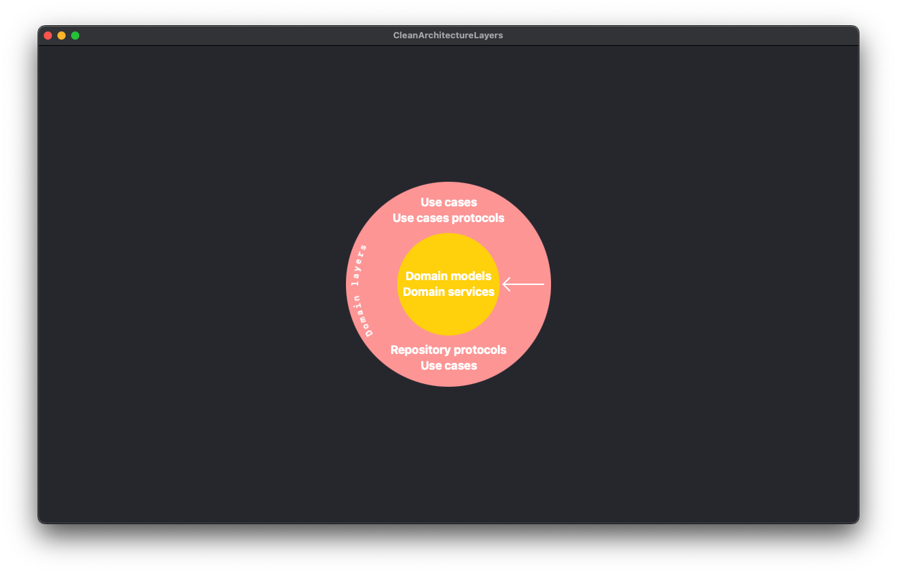

# Arquitecturas limpias, como desacoplar la lógica de negocio de los detalles de infraestructura

Se dice que una arquitectura es limpia cuando consigue una exitosa separación entre la lógica de negocio y los detalles de la infraestructura. Dicha separación se consigue mediante capas, una fuerte aplicación de los principios SOLID y un estricto cumplimiento de lo que llamaremos "La regla de la dependencia". Hablaremos de ella más adelante.

Según Robert C. Martin, Uncle Bob, estas arquitecturas generan sistemas, productos, que son: 
1. Independientes del framework usado.
2. Con unas reglas comerciales que deben poder ser medibles sin depender de la interfaz del usuario, base de datos, servidor web, etc.
3. Independientes de dicha interfaz de usuario. De hecho, ésta, debería poder ser intercambiable sin afectar a las reglas comerciales, a la anteriormente citada lógica de negocio.
4. Independientes de la base de datos usada, si es que es necesario usarla, independiente del sistema de persistencia de datos, local u online.
5. Independientes, en general, de cualquier interferencia externa. 

> En resumen: Las reglas de negocio no deben de conocer nada de los detalles de infraestructura, para así no depender de estos. 

Más en detalle...

## Lógica de negocio

La llamada lógica de negocio representa el dominio. Se trata de una serie de reglas, acciones y datos que representan nuestro negocio, sus actividades, etc. Por ejemplo, en una aplicación bancaria parte de nuestra lógica de negocio serían los modelos destinados a abstraer las cuentas corrientes del usuario, las tarjetas, movimientos, etc. ¿Qué entraría también en nuestra lógica de negocio?, todas aquellas reglas que nos ayuden a definirlo: impedir que un usuario sin fondos intente hacer una transferencia, verificar que la cuenta aportada por el usuario tenga un IBAN válido, la lógica de ofuscación para que no se muestre el número de cuenta completo sino sustituyendo algunos dígitos por asteriscos...

> **Importante**: La lógica de negocio es común a todos los departamentos de la compañía: marketing, diseño, producto...

## Detalles de la infraestructura

Aquí hacemos referencia al framework que usamos para diseñar las vistas de nuestra aplicación, la librería de red, el inyector de dependencias, la base de datos, el modelo de persistencia, etc. 

Estos componentes "no tienen vida" fuera de nuestro sistema, nuestra app, nuestra web. Y deberían ser transparentes para el resto de departamentos de la compañía. 

> Mientras que la lógica de negocio varía poco en el tiempo, los detalles de infraestructura sí que pueden verse alterados. En un MVP podemos decidirnos por usar un sistema gestor de base de datos sencillo, poco escalable, y rápido de implementar, ya que solo queremos ver si nuestro producto tiene tracción en el mercado. En caso de funcionar podríamos necesitar cambiarlo. O cambiar el framework mediante el que presentamos la interfaz al cliente porque éste haya sido descontinuado.

> Por ésto último decíamos que las reglas de negocio no debían conocer nada de los detalles de infraestructura, por la alta posibilidad de que estos cambien en el futuro. Implementando una arquitectura limpia podemos conseguir que si necesitamos cambiar alguna parte de nuestra infraestructura, la pieza a cambiar pueda ser sustituida por otra sin afectar a nuestra lógica de negocio, minimizando así el impacto de dichos cambios.

En la siguiente imagen, del [blog de Robert C. Martin (Uncle Bob)](https://blog.cleancoder.com/uncle-bob/2012/08/13/the-clean-architecture.html), podemos ver una representación de capas y responsabilidades que deberían de cumplirse en cualquier arquitectura limpia. 

En su artículo de referencia, [aquí](https://blog.cleancoder.com/uncle-bob/2012/08/13/the-clean-architecture.html), Uncle Bob explica que el número de capas, los círculos, son esquemáticos, que no hay por qué tener "solo" cuatro capas, éstas serían las mínimas. A la hora de crear nuevas capas, o dividir alguna de las actuales, solo tendríamos que tener en cuenta que se siga aplicando la regla de la dependencia. 

## Capas de nuestra arquitectura

¿Cómo podríamos llevarnos esta *clean architecture* a nuestro proyecto con SwiftUI o Jetpack Compose?, montémoslo paso a paso.

### Core
---

Contendría el código más estático, aquel del que va a depender el resto. Todas las capas exteriores van a depender de ésta, estarán acopladas a ella, por lo que cualquier cambio en esta capa tendrá repercusiones en el resto de capas de nuestra arquitectura. 

Esta capa no tiene ningún acoplamiento con una capa exterior, es más, no debe conocer ningún componente creado fuera de su propia capa. Esto es lo que denominamos **La regla de la dependencia** y es de obligado cumplimiento para mantener nuestra arquitectura limpia. Y no solo es de obligado cumplimiento para esta capa, también para todas las exteriores, ¿qué nos dice Uncle Bob de la regla de la dependencia?

> **La regla de la dependencia:**  
>
> *La regla primordial que hace que esta arquitectura funcione es la regla de dependencia . Esta regla dice que las dependencias del código fuente sólo pueden apuntar hacia adentro . Nada en un círculo interno puede saber nada acerca de algo en un círculo externo. En particular, el nombre de algo declarado en un círculo exterior no debe mencionarse en el código del círculo interior. Eso incluye funciones, clases, variables o cualquier otra entidad de software.* - Uncle Bob

¿Qué contendría, por ejemplo, esta capa Core?

1. **Modelos de dominio:** abstracción de una cuenta corriente, tarjeta de crédito, débito, movimiento, comisión...
2. **Servicios de dominio:** clases relacionadas con los modelos de dominio y que ayudan a implementar nuestras **reglas de negocio, hablaremos de ellas en la siguiente sección**. Por ejemplo, la clase que se ocupa de calcular las tasas que vas a pagar por una determinada operación, la funcionalidad que se ocupa de verificar que, a priori, no hay un problema para realizar una transferencia, la comprobación de que no estás intentando enviar más dinero del que tienes en la cuenta...

> No confundir estos servicios de dominio con una clase que, por ejemplo, realice una petición de red para recibir el visto bueno a un préstamo, o a una transferencia, estos servicios de dominio engloban y abstraen nuestra lógica de negocio, nuestras reglas. No os preocupéis si no estáis familiarizados con estos términos, terminaremos entendiéndolos mejor con los ejemplos. 

Nuestos modelos de dominio también los encontrarás citados, aquí o en otros artículos, charlas, etc, como **Entities** o **Data Objects**. Veamos una representación de esta capa.

Los componentes de esta capa solo pueden tener dependencias entre ellos, tanto de los modelos como de los servicios, ya que están en la misma capa. Como podemos apreciar en esta representación, nuestra capa **core** no conoce nada fuera de su capa, no hay una capa inferior de la que dependa.

¿Qué tipo de acoplamiento podríamos tener en esta capa?, pues por ejemplo: la abstracción *CreditCard* podría tener una dependencia con *Movements* al tener que gestionar una colección de éstos.

### Lógica de negocio
---

Esta capa contendría las reglas comerciales específicas de nuestra aplicación. Por convención, al software que diseñamos en esta capa se le llama **Casos de Uso**. Los usamos para dirigir el flujo de datos desde nuestras entidades y hacia éstas. 

**¿Reglas comerciales?, ¿Reglas de negocio?, ¿de qué nos estás hablando?, veámoslo mejor con ejemplos...** 

- Queremos que el usuario pueda realizar una transferencia a otra cuenta bancaria, las reglas de negocio podrían ser: 
    - Impedir que intente realizar la transferencia si no tiene fondos suficientes
    - Verificar que la cuenta de destino tiene un formato correcto (20 dígitos)
    - Verificar que el IBAN de la cuenta es correcto (el IBAN se calcula en base al número de cuenta)

Los cambios en esta capa no afectarían a nuestros modelos de dominio y tampoco deberían verse afectados por cambios externos. ¿Cómo mantenemos nuestra *regla de la dependencia*?. Los casos de uso establecerán sus *contratos*, *protocolos*, *interfaces*, como queramos llamarlos, y serán implementados por los componentes de la capa superior.

Estos protocolos habitan en la misma capa que los casos de uso, ya que pertenecen a nuestra lógica de negocio. 

Dicho todo esto, nuestros casos de uso tendrían dependencias de: 
1. Nuestros modelos, y servicios, de dominio, que se encuentran en una capa inferior.
2. Otros casos de uso. Un caso de uso podría necesitar información que obtuviese mediante otro. 
3. Los protocolos, interfaces, que implementan o de los que tienen dependencias por composición. 

¿Cómo quedaría nuestra representación de capas?

He dibujado la dependencia de esta capa, con la capa inferior, mediante una flecha hacia dentro del gráfico. Lo veréis así en el resto del artículo, y también con el resto de capas.

### Adaptadores
---

Los adaptadores establecen un puente entre la lógica de negocio y los detalles de infraestructura. Aquí se encuentran los componentes que implementan los contratos, protocolos, interfaces, definidos en la capa inferior (Casos de uso).

Esta capa también se ocupa de "traducir", mapear, los datos que obtenemos desde capas externas a datos de nuestra lógica de negocio.

La capa de adaptadores estaría dividida en varias secciones, cómo mínimo, estas dos:
1. **Capa de presentación:** donde encontraríamos los viewmodels, presenters, etc
2. **Capa de datos:** donde encontraríamos los repositorios, protocolos de datasource, mappers, protocolos de Data Objects, etc

Hay un cambio importante con relación a las capas inferiores. En éstas todos sus componentes se "conocían" entre sí y podían depender unos de otros. En la capa **Adaptadores** esto no es posible, y es muy importante que se cumpla esta regla. Los componentes de la capa de presentación no pueden tener ningún tipo de dependencia de componentes de la capa de datos y viceversa, no pueden estar acoplados. 

Un ViewModel no podría, por ejemplo, instanciar un objeto de la capa de datos, tendría que hacerlo a través de los casos de uso, a través de su capa inferior. Son flujos que están separados. Ayúdemonos de una representación gráfica:

> La capa de adaptadores podría estar dividida en más partes, secciones. He citado estas dos porque considero que son las más comunes a cualquier arquitectura limpia, independientemente de la tecnología del proyecto, sea web, app, etc...
> 
> Por ejemplo, un manager que gestionase la analítica de nuestro negocio, aplicación, etc, también pertenecería a esta capa de adaptadores. Y al igual que las capas de presentación y datos no podría tener dependencias con éstas. 

Podemos observar cómo la capa de adaptadores está acoplada a la de use cases, así como ésta lo está a la de dominio. Nada definido aquí, en la capa de adaptadores, podría ser "invocado" en la capa de use cases. Para eso usamos el principio de la inversión de dependencias, implementamos en nuestros componentes los protocolos necesarios, que tenemos definidos en la capa inferior, y los inyectamos donde sea necesario.

Si nos fijamos, esta capa tiene dependencias de los protocolos de casos de uso que tiene que implementar y de los modelos de datos que usen estos protocolos, en resumen, de sus capas inferiores. Pero no sabe si vamos a realizar las llamadas de red mediante URLSession o HttpURLConnection, o a usar una librería de terceros como Alamofire u OkHttp. No sabe si persistiremos los datos sensibles en UserDefaults - SharedPreferences o usaremos Keychain - KeyStore (es un ejemplo, para datos sensibles usad KeyStore - Keychain).

Esto quiere decir que esta capa de red desconoce estas implementaciones, por lo que evita su acoplamiento a las mismas. ¿Cómo se comunica con las capas superiores?, de la misma forma que los use cases se comunican con ellos, mediante contratos, interfaces, protocolos y, de nuevo, la magia de la inversión de las dependencias. 

### Capa de infraestructura
---

Al principio del artículo hablábamos sobre que había que separar la lógica de negocio de los detalles de la infraestructura. Hasta ahora habíamos visto la lágica de negocio, mediante sus capas contenedoras de las entidades y casos de uso. Y también habíamos hablado de una capa, adaptadores, que hacía de puente entre ésta y la capa de infraestructura. Hablemos ahora de ésta última.

Esta capa contendría todos los componentes relacionados con la interfaz de usuario, por ejemplo las vistas en Jetpack Compose - SwiftUI o XML - UIKit. Contendría las clases necesarias para realizar una llamada de red y obtener los datos que necesitamos inyectar en nuestros repositorios para que éstos, a su vez, lo hagan en los casos de uso. Para ello usaríamos URLSession, HttpURLConnection, Alamofire, OkHttp o similares. En caso de tener que persistir datos sería esta capa la que se encargaría de implementar la funcionalidad mediante una base de datos local (sqlite, room, coredata, swiftdata...)

Fijáos en la diferencia de esta capa con las más internas. Aquí ya estamos hablando de tecnologías, frameworks, etc. Mientras antes hablábamos de cuentas, movimientos, tarjetas...

Esta parte, aunque no nos entre en la cabeza a los desarrolladores, es transparente al usuario y al resto de stakeholders de la compañía. Aunque nos duela, esta parte solo nos interesa a nosotros...

Esta es la parte que es más susceptible de sufrir cambios durante la vida de un proyecto. Mediante nuestra arquitectura limpia conseguimos que un cambio en cualquier componente de esta capa no tenga ninguna repercusión en las capas inferiores, en nuestra lógica de negocio. Si tenemos que cambiar alguno de estos componentes estará tan aislado que el cambio se limitará a sustiuir un componente por otro, sin que el resto de componentes deba sufrir ninguna alteración. Si lo hacemos bien, estos componentes, de red, de UI, de almacenamiento, etc, actuarán como meros plugins de nuestra lógica de negocio, sustituibles. 

Nadie espera tener que modificar las ruedas de una bicicleta, o el sistema de frenado, al cambiar el sillín de una bicicleta. Nuestras arquitecturas deben funcionar igual. Nuevamente conseguimos esta capacidad de fácil sustitución mediente el uso de los principios SOLID y su inversión de las dependencias.

¿Echamos un vistazo a la representación final de nuestra arquitectura?

> Esta capa tiene la misma particularidad que la capa adaptadores, aunque las vistas están en la misma capa que los *data sources* éstos no se *"conocen"*, no tienen dependencias entre ellos ni por herencia ni por composición. En resumen, no están acoplados entre ellos. 

Acoplar la lógica de negocio y los detalles de infraestructura lleva siendo un problema desde que empezamos a desarrollar software, no es algo nuevo. Este movimiento no ha surgido en los últimos 10 años debido al purismo de algunos desarrolladores. No, el senior no está intentando ponértelo más difícil...

Este problema ya existía cuando los programadores escribían software que leía información de tarjetas perforadas. ¿Qué creéis que pasaba cuando les pedían cambiar dicho programa para que ahora leyese la información de una cinta magnética?...

## Ventajas e inconvenientes

### Ventajas

Una mejora significativa en el coste de nuevas features al tener el código mejor estructurado, más desacoplado y con una visión más clara, y amplia, de los elementos que vas a necesitar para implementar cada una de las capas de tu arquitectura. 

### Inconvenientes

Puede suponer una barrera de entrada para desarrolladores Junior que no conozcan este tipo de arquitecturas. 